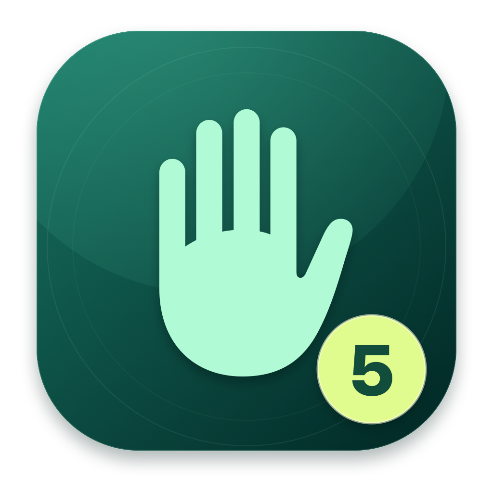

<p align="center">
  
</p>

<h1 align="center">FingerCount — offline finger counting for macOS</h1>

<p align="center">
  指尖计数 · Hold up your fingers. See the number appear.<br>
  A small, offline macOS app that counts extended fingers from a live camera feed.
</p>

<p align="center">
  macOS 13+ · Apple Silicon & Intel · SwiftUI + Apple Vision · No third-party dependencies
</p>

<p align="center">
  <a href="#quick-start">Get started</a> ·
  <a href="#how-it-works">How it works</a> ·
  <a href="#中文快速上手">中文快速上手</a>
</p>

## What you get

| Feature | What it does |
| --- | --- |
| **Count 0–10** | Count the fingers on up to two hands, with a large live total. |
| **See each finger** | View each hand's count and which of its five fingers were classified as extended. |
| **Follow the landmarks** | A live skeleton overlay shows the hand points used for counting. |
| **Make it your view** | Start and stop the camera, or toggle a mirrored preview. |
| **Choose your language** | Use System, English, or 中文 from the picker in the header. |

No hand in view shows **—**; a detected closed fist shows **0**. The app processes camera frames on your Mac and does not record or upload them. The interface follows your macOS language by default and can be changed in the app.

## Quick start

### Build from source

You need **macOS 13 or newer** and a full Xcode installation. Select it with `xcode-select` or set `DEVELOPER_DIR` if Xcode lives outside `/Applications`. Command Line Tools alone are not enough.

```bash
./build.sh
open build/FingerCount.app
```

The script builds a universal `arm64`/`x86_64` app and applies ad hoc code signing. It does not notarize the app. No package manager, account, downloaded model, or API key is required.

### Use the app

1. Click **Start camera** (**开启摄像头**) and allow camera access when macOS asks.
2. Face your palm toward the camera and hold one or two hands fully in frame.
3. Read the total on the right; the rows below show each detected hand and its finger states.
4. Use **Mirror** (**镜像画面**) or **Stop** (**停止**) as needed.

For steadier results, use even light, separate your fingers slightly, and keep your palms visible. If access was denied, enable it under **System Settings → Privacy & Security → Camera**.

## How it works

```text
Camera → AVFoundation → Apple Vision hand landmarks
       → 2D finger geometry → per-hand counts → live total
```

`VNDetectHumanHandPoseRequest` finds up to two hands and supplies 21 landmarks per hand. `FingerCounter` checks relative joint angles and distances to classify each finger. A short history smooths the displayed total. The preview and landmark overlay are drawn with SwiftUI and AppKit.

This is **Apple Vision hand tracking, not YOLO**. The finger decisions are geometric heuristics on 2D landmarks; no custom model is trained or bundled.

### Project layout

| Path | Purpose |
| --- | --- |
| `Sources/CameraModel.swift` | Camera permission, capture, Vision requests, and count updates |
| `Sources/FingerCounter.swift` | Per-finger geometry and count logic |
| `Sources/CameraPreview.swift` | Camera preview and landmark overlay |
| `Sources/FingerCountApp.swift` | SwiftUI interface |
| `Sources/AppLanguage.swift` | System, English, and Chinese language selection |
| `Tests/FingerCounterTests.swift` | Synthetic tests for all 32 finger combinations, geometric transforms, and invalid landmarks |

To run the counting tests:

```bash
mkdir -p build
DEVELOPER_DIR="${DEVELOPER_DIR:-$(xcode-select -p)}" xcrun swiftc \
  -parse-as-library -module-cache-path build/typecheck-cache \
  Sources/FingerCounter.swift Tests/FingerCounterTests.swift \
  -o build/finger-counter-tests
./build/finger-counter-tests
```

## Privacy and limits

- Camera frames are handled locally. The app does not save them, send them to a server, or include analytics.
- Counting can be wrong when fingers overlap, a hand is edge-on, landmarks are missed, or lighting is poor. There is no published accuracy benchmark yet.
- The two hand rows describe current detections; they are not persistent left/right hand identities.
- Mirroring changes the preview, not the finger count.

Issues and pull requests are welcome, especially reproducible gesture examples and suggestions for improving occlusion handling or adding interface translations. If the project is useful to you, a GitHub star helps others find it.

## 中文快速上手

需要 **macOS 13 及以上**及完整 Xcode。在仓库目录运行 `./build.sh`，然后打开 `build/FingerCount.app`。界面默认跟随系统语言，也可在顶部切换「跟随系统 / English / 中文」。点击「开启摄像头」并允许权限；「镜像画面」切换预览方向，「停止」关闭摄像头。握拳显示 **0**，未检测到手显示 **—**。画面只在本机处理，不会保存或上传。
